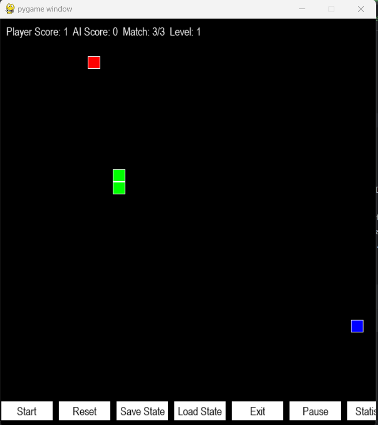

# Snake Game with Reinforcement Learning

## Overview

This project is a Snake game implemented in Python using Pygame and enhanced with a reinforcement learning agent to play against. The AI agent uses a Deep Q-Network (DQN) approach to learn and improve its gameplay over time.

  

## Features

- **Player Snake**: Controlled by the user with the arrow keys.
- **AI Snake**: Controlled by a reinforcement learning agent using DQN.
- **Rats**: The goal is to eat the rats that appear on the board.
- **Levels and Matches**: Progress through levels and matches by eating rats and avoiding collisions.
- **Save and Load**: Save the game state and AI model to continue later.
- **Statistics**: Real-time statistics of the AI's training process.

## Installation

1. **Clone the repository**:
    ```bash
    git clone https://github.com/yourusername/SnakeGameRL.git
    cd SnakeGameRL
    ```

2. **Create and activate a virtual environment**:
    ```bash
    python -m venv venv
    source venv/bin/activate   # On Windows, use `venv\Scripts\activate`
    ```

3. **Install the required packages**:
    ```bash
    pip install -r requirements.txt
    ```

4. **Run the game**:
    ```bash
    python main.py
    ```

## Reinforcement Learning Methods

The AI snake in this game uses a Deep Q-Network (DQN) to learn from its actions. Here’s a brief explanation of the method:

### Deep Q-Network (DQN)

1. **State Representation**: The game board is represented as a grid, where the position of the player snake, AI snake, and rats are encoded as states.
2. **Action Space**: The possible actions (UP, DOWN, LEFT, RIGHT) that the snake can take.
3. **Q-Function**: A neural network is used to approximate the Q-function, which predicts the expected future rewards for each action given a state.
4. **Experience Replay**: The agent stores its experiences (state, action, reward, next state) in a memory buffer and samples from it to update the Q-network, which helps to break the correlation between consecutive experiences.
5. **Exploration vs. Exploitation**: The agent uses an ε-greedy policy to balance exploration (trying new actions) and exploitation (using actions that are known to yield high rewards).

### How It Helps in Studying Reinforcement Learning

- **Interactive Learning**: Playing against an AI that learns and improves provides an interactive way to see reinforcement learning in action.
- **Real-Time Training**: The game includes real-time statistics to visualize the training process of the AI.
- **Customizable**: The code is modular and can be modified to experiment with different reinforcement learning algorithms and strategies.

## Future Work

- **Game World Segmentation**: Pre-segmenting the game world to simplify state representation and improve the AI's learning efficiency.
- **Advanced AI Techniques**: Implementing more advanced techniques like Double DQN, Dueling DQN, or Proximal Policy Optimization (PPO).
- **Enhanced Graphics and UI**: Improving the game’s visual appeal and user interface for a better gaming experience.

## License

This project is licensed under the MIT License - see the [LICENSE](LICENSE) file for details.

## Acknowledgments

- Pygame for the game framework.
- Keras and TensorFlow for the deep learning libraries.
- The Pygame and Reinforcement Learning communities for their tutorials and support.
